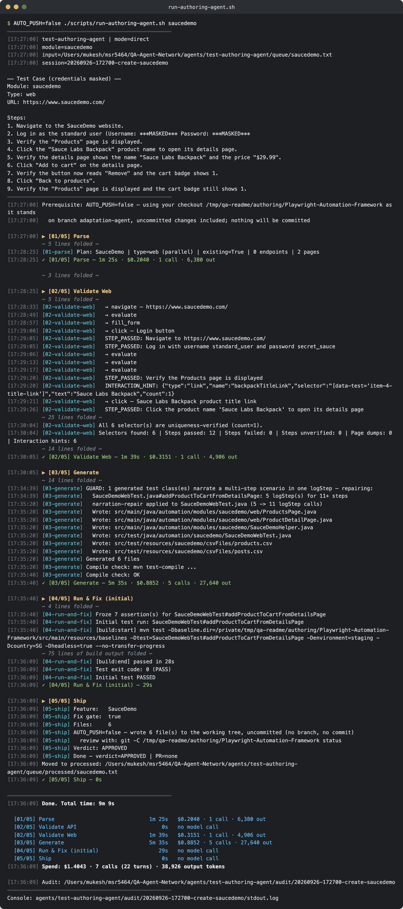
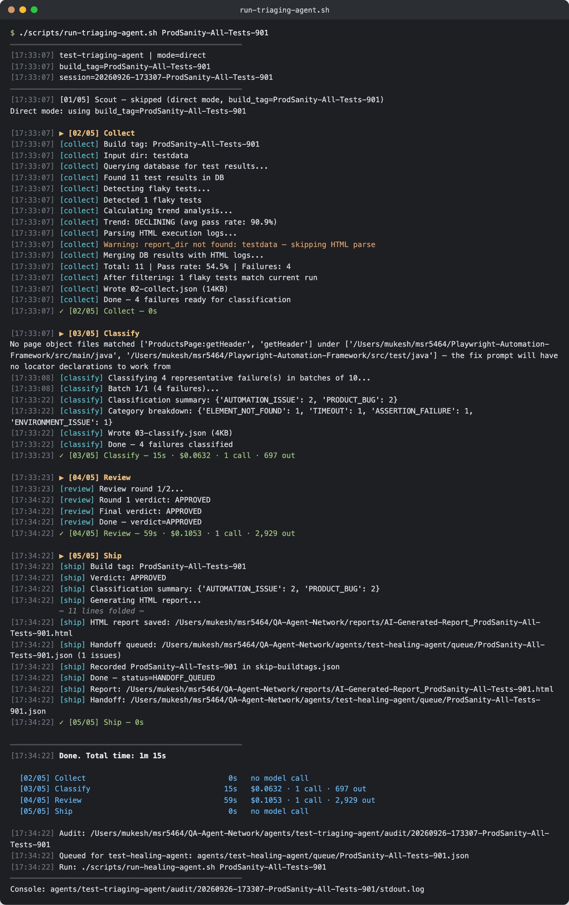
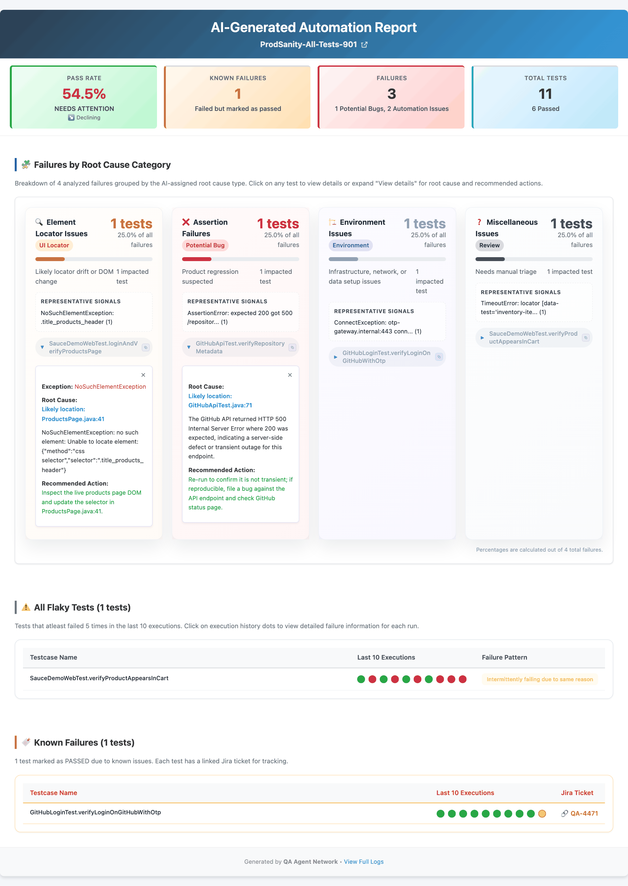
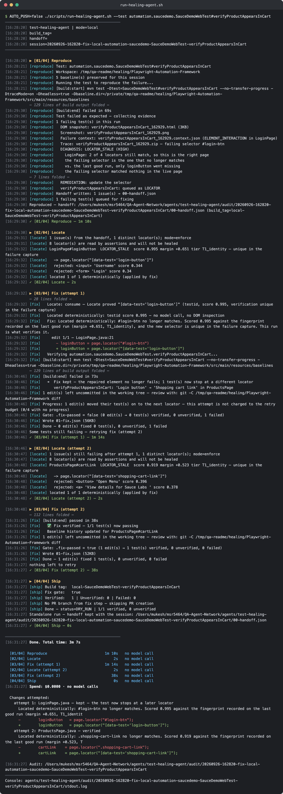
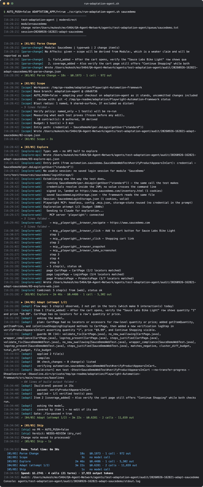

<div>
  

  # QA Agent Network

  [](https://www.python.org/)
  [](LICENSE)
</div>

**🌐 [msr5464.github.io/ai-agent-network](https://msr5464.github.io/ai-agent-network.html)**

*An AI-driven multi-agent system for end-to-end QA automation — authoring tests, triaging failures, healing broken locators, and adapting tests when the product changes.*

It works on a separate Java automation repo (the *automation repo*, named by
`GITHUB_REPO_AUTOMATION` — e.g. [Playwright-Automation-Framework](https://github.com/msr5464/Playwright-Automation-Framework))
and opens GitHub PRs against it. Run the agents from the CLI, from CI, or from the
[AI-Test-Studio](https://github.com/msr5464/AI-Test-Studio) web UI.

---

## Documentation

| Doc | Purpose |
|-----|---------|
| [ARCHITECTURE.md](docs/ARCHITECTURE.md) | How the agents work: steps, handoffs, diagnosis, server execution model, audit layout |
| [DEVELOPER_GUIDE.md](docs/DEVELOPER_GUIDE.md) | Local setup, running and resuming each agent, tests, debugging |
| [TROUBLESHOOTING.md](docs/TROUBLESHOOTING.md) | Common errors and fixes, per agent |
| [SERVER_API.md](docs/SERVER_API.md) | REST + SSE reference for `qa_agents_server` (what AI-Test-Studio calls) |
| [DEPLOYMENT.md](docs/DEPLOYMENT.md) | Running the server for a team, CI (Jenkins) integration |
| [FRAMEWORK_INTEGRATION.md](docs/FRAMEWORK_INTEGRATION.md) | What the automation repo must provide; adding a framework plugin |
| [docs/examples/queue/](docs/examples/queue/README.md) | Worked input examples for every agent |
| [locator-eval/](locator-eval/README.md) | Offline benchmark for the healing locator engine |
| [config/prompts/](config/prompts/README.md) | The prompt files the agents load at runtime |
| `agents/<agent>/CLAUDE.md` | Each agent's full spec, for maintainers |

Feature write-ups on the portfolio site:
[Test Design](https://msr5464.github.io/feature-test-design.html) (an AI-Test-Studio feature) ·
[Test Authoring](https://msr5464.github.io/feature-test-authoring.html) ·
[Test Triaging](https://msr5464.github.io/feature-test-triaging.html) ·
[Test Healing](https://msr5464.github.io/feature-test-healing.html) ·
[Test Adaptation](https://msr5464.github.io/feature-test-adaptation.html) ·
[Talk to Tests](https://msr5464.github.io/feature-rag-chat.html) (an AI-Test-Studio feature)

---

## How It Works

Four independent agents, each owning a distinct slice of the QA lifecycle:

```
Plain English test steps
         │
         ▼
┌─────────────────────────────────────────────────────┐
│  Agent 1: test-authoring-agent                      │
│  01 Parse     → plain text → structured plan        │
│  02 Validate  → API: real HTTP calls                │
│                 Web: Claude + Playwright MCP checks │
│                 every selector in a real browser    │
│  03 Generate  → write Java into the automation repo │
│  04 Run + Fix → run the test → Claude fix → retry   │
│  05 Ship      → branch + PR + Slack                 │
└─────────────────────────────────────────────────────┘

CI test build finishes
         │
         ▼
┌─────────────────────────────────────────────────────┐
│  Agent 2: test-triaging-agent                       │
│  01 Scout    → pick an unanalysed build from MySQL  │
│  02 Collect  → DB query + HTML logs + artefacts     │
│  03 Classify → failure diagnosis, then Claude       │
│  04 Review   → adversarial review + verdict gate    │
│  05 Ship     → HTML report + Slack + handoff JSON   │
└──────────────────────────┬──────────────────────────┘
                           │  queue/<build_tag>.json
                           │  (locator failures only)
                           ▼
┌─────────────────────────────────────────────────────┐
│  Agent 3: test-healing-agent                        │
│  01 Reproduce → (standalone) run the named test     │
│  02 Locate    → deterministic selector proposal     │
│  03 Fix       → diagnose → edit locator → re-run  ↺ │
│  04 Ship      → branch + PR + Slack                 │
└─────────────────────────────────────────────────────┘

A human learns the product changed (before anything goes red)
         │
         ▼
┌─────────────────────────────────────────────────────┐
│  Agent 4: test-adaptation-agent                     │
│  01 Parse Change → 02 Scope → 03 Explore (live app) │
│  → 04 Adapt → 05 Ship (PR is always NEEDS-REVIEW)   │
└─────────────────────────────────────────────────────┘
```

- **Authoring** turns plain-English steps into framework-compliant Java tests,
  proves the selectors against the real app, runs the tests, fixes failures, and
  raises a PR.
- **Triaging** classifies every CI failure (`PRODUCT_BUG` / `AUTOMATION_ISSUE`),
  writes an HTML report, and queues only the fixable locator failures for healing
  ([exact rule](docs/ARCHITECTURE.md#handoff-criteria)).
- **Healing** fixes broken locators and nothing else. A deterministic engine
  proposes a selector from fingerprints recorded on the last green run; Claude
  steps in only when it cannot. Every fix is proven by re-running the real test.
  A PR ships for whatever passed.
- **Adaptation** updates tests when the *product* changes, driven by a change
  note. Because an edit may add or remove steps, "the test passes" is not enough
  evidence — each test's **intent contract** (what it proves) is frozen before
  any edit and checked afterwards.

See [ARCHITECTURE.md](docs/ARCHITECTURE.md) for the details.

---

## Prerequisites

| Tool | Why |
|------|-----|
| Python **3.10+** | The agents and server |
| [Claude Code CLI](https://docs.anthropic.com/en/docs/claude-code) (`claude`), signed in (`claude auth login`) | Every model call goes through it |
| Node.js 18+ with `npx` | The Playwright MCP server (browser validation and exploration) |
| Chromium for Python Playwright (`python -m playwright install chromium`) | The locator engine |
| GitHub CLI (`gh`) | Opening PRs (it uses `GITHUB_TOKEN`) |
| JDK 21 + Maven 3.8+ | Compiling and running the automation repo's tests |
| MySQL with your CI results | Triaging only |
| `make` and `bash` | Entry points. On Windows use Git Bash or WSL |

---

## Quick Start

### 1. Install

```bash
git clone https://github.com/msr5464/QA-AI-Agent.git QA-Agent-Network
cd QA-Agent-Network

./scripts/setup.sh          # macOS / Linux: .venv, dependencies, config/.env
.\scripts\setup.ps1         # Windows (no venv; uses the python on PATH)

python -m playwright install chromium
```

`setup.sh` creates `config/.env` from `config/.env.example` if it does not exist yet.

### 2. Minimum configuration

Edit `config/.env`. [`config/.env.example`](config/.env.example) documents every
setting and is the reference; these are the ones you must set:

```bash
# Where the automation repo lives — one of:
WORKSPACE_DIR=/path/to/parent          # repo at $WORKSPACE_DIR/$GITHUB_REPO_AUTOMATION (cloned if absent)
# FRAMEWORK_DIR=/path/to/the/checkout  # or point at the checkout directly

GITHUB_REPO_AUTOMATION=Playwright-Automation-Framework   # required, even with FRAMEWORK_DIR
GITHUB_ORG=your-org-or-user
GITHUB_TOKEN=ghp_...                   # repo scope: clone, push, PRs
GITHUB_DEFAULT_BRANCH=main

AUTO_PUSH=false                        # start with dry runs: no push, no PR

# Optional: Slack (skipped when unset)
# SLACK_BOT_TOKEN=xoxb-...
# Triaging only: TRIAGING_DB_HOST / _PORT / _USER / _PASSWORD / _NAME
```

Anything exported in your shell overrides `config/.env` for that run.

### 3. First run

The seeded examples target the `saucedemo` module that
Playwright-Automation-Framework already has:

```bash
cp docs/examples/queue/test-authoring-agent/saucedemo_web_product.txt \
   agents/test-authoring-agent/queue/saucedemo.txt
./scripts/run-authoring-agent.sh saucedemo
```

With `AUTO_PUSH=false` the run works **in your local checkout as it stands**
(uncommitted changes included), and nothing is pushed. Every run leaves a full
audit trail in `agents/<agent>/audit/<session-id>/`; browse it with
`make dashboard`.

---

## Running the agents

`make help` lists every command. `MODULE` names a file in the agent's queue
(`agents/<agent>/queue/<MODULE>.txt`). With no `MODULE`/`BUILD_TAG`, authoring,
healing and adaptation take the oldest item in their queue; triaging has no
queue and scouts the results database instead.

The screenshots below are real runs of these scripts against the `saucedemo`
module. Authoring, healing and adaptation ran with `AUTO_PUSH=false`, so none of
them opened a PR. Build output and some routine lines are folded, and each fold
says how many lines it hides.

### Agent 1 — Test Authoring

```bash
./scripts/run-authoring-agent.sh payments                     # queue/payments.txt
./scripts/run-authoring-agent.sh                              # oldest file in queue/
TESTING_MODE=true ./scripts/run-authoring-agent.sh payments   # reuse cached steps 01–02
START_FROM_STEP=4 SESSION_ID=<id> ./scripts/run-authoring-agent.sh   # resume
```

Input format ([examples](docs/examples/queue/README.md#test-authoring-agent)):

```
Module: payments
Type: web
URL: https://app.staging.example.com

Steps:
1. Login as Admin user
2. Click New Payment and fill in recipient + amount
3. Submit and verify success message appears
```

Output: Java files in the automation repo, a PR on branch
`authoring/<module>-<timestamp>`, and a Slack message.

The Quick Start example, run for real. The browser proves every step and
selector, a guard splits the test's run-on narration into one `logStep` per step,
and the generated test passes on its first run:



### Agent 2 — Test Triaging

```bash
./scripts/run-triaging-agent.sh                             # scout: most recent unanalysed build
./scripts/run-triaging-agent.sh ProdSanity-All-Tests-541    # a specific build tag
STOP_AFTER=classify ./scripts/run-triaging-agent.sh         # stop early for inspection

.\scripts\run-triaging-agent.ps1 -BuildTag ProdSanity-All-Tests-541   # Windows
```

Output: an HTML report in `TRIAGING_OUTPUT_DIR/`, a handoff file in
`agents/test-healing-agent/queue/<build_tag>.json` when anything is fixable, and
a Slack message.



The report from that run, with two failures expanded to show the root cause, its
likely location and the recommended action:



### Agent 3 — Test Healing

```bash
# From a triaging handoff
./scripts/run-healing-agent.sh                              # oldest handoff in the queue
./scripts/run-healing-agent.sh ProdSanity-All-Tests-541     # a specific build tag
./scripts/run-healing-agent.sh /path/to/handoff.json        # a handoff file

# Standalone: name the broken test, no triaging needed
./scripts/run-healing-agent.sh --test LoginTest#testLogin
./scripts/run-healing-agent.sh --test automation.saucedemo.SauceDemoWebTest   # a whole class
REPAIR=true ./scripts/run-healing-agent.sh --test LoginTest#testLogin    # park the failing browser for live inspection
FORCE=true  ./scripts/run-healing-agent.sh --test LoginTest#testLogin    # proceed even if it is not a locator failure

.\scripts\run-healing-agent.ps1 -BuildTag ProdSanity-All-Tests-541   # Windows
```

Output: a PR on branch `healing/<session-id>` with every fix that passed, and a
Slack message with the per-test breakdown. Partial success still ships.

A standalone run against two deliberately renamed locators. Repairing the login
button lets the test reach the broken cart link, and the next attempt repairs that.
Both are located deterministically, with no model call:



### Agent 4 — Test Adaptation

Healing asks "why did this fail?". Adaptation asks "the product changed — what
should the tests do now?".

```bash
./scripts/run-adaptation-agent.sh checkout                         # propose only (the default)
ADAPTATION_APPLY=true ./scripts/run-adaptation-agent.sh checkout   # apply, verify, open a PR
EXPLORE_ONLY=true     ./scripts/run-adaptation-agent.sh checkout   # flow map only
START_FROM_STEP=4 SESSION_ID=<sid> ./scripts/run-adaptation-agent.sh   # resume
```

Change note, `agents/test-adaptation-agent/queue/<module>.txt`
([examples](docs/examples/queue/README.md#test-adaptation-agent)):

```
Module: checkout
Type: web
Affects: automation.checkout.*

What changed:
1. After login a "Choose workspace" screen now appears before the dashboard.
2. The 3-step checkout wizard is now 2 steps.

Expected outcome unchanged: an order is placed and a confirmation number is shown.
```

Output:
- A blast radius: the named tests, the tests that pass today but share the changed
  surface, and what was excluded as framework infrastructure — with the cost of
  verifying them.
- An ordered flow map of what a browser actually observed, with every selector
  re-counted in Python rather than taken on the model's word.
- With `ADAPTATION_APPLY=true`, a PR that is **always NEEDS-REVIEW**, carrying
  each edit against the observed step that justified it. By default the edits
  are only proposed. Each one is written, compiled and checked against the frozen
  intent contracts, then rolled back so a human can review it.

It refuses rather than guesses when the change note does not account for what it
saw, when the expected *outcome* changed (the spec moved, not the test), when no
login session can be restored or minted, or when the flow ends in something that
cannot be undone. See [agents/test-adaptation-agent/CLAUDE.md](agents/test-adaptation-agent/CLAUDE.md).

The `saucedemo_cart_details` example, applied for real. The agent mints a login
session the way the test does, walks the flow in a browser, adds the missing cart
checks, and proves them with a test run:



---

## Slack Notifications

All four agents post through the Slack Bot API (`chat.postMessage`). Without
`SLACK_BOT_TOKEN`, Slack is skipped silently.

1. [api.slack.com/apps](https://api.slack.com/apps) → **Create New App** → From scratch
2. **OAuth & Permissions** → Bot Token Scopes → add `chat:write`
3. **Install to Workspace** → copy the **Bot User OAuth Token** (`xoxb-...`) into `SLACK_BOT_TOKEN`
4. In each target channel, run `/invite @your-bot-name`

| Event | Channel |
|-------|---------|
| Authoring: tests pass, or not run | `SLACK_NOTIFY_CHANNEL` |
| Authoring: tests failing, stuck, reproducing a known defect, or push/PR failed | `SLACK_ALERT_CHANNEL` |
| Adaptation: ready for review (a PR, or a proposal) | `SLACK_NOTIFY_CHANNEL` |
| Adaptation: escalated, or push/PR failed | `SLACK_ALERT_CHANNEL` |
| Triaging: verdict APPROVED | `SLACK_NOTIFY_CHANNEL` |
| Triaging: verdict NEEDS-HUMAN | `SLACK_ALERT_CHANNEL` |
| Healing: all tests fixed | `SLACK_NOTIFY_CHANNEL` |
| Healing: some or none fixed | `SLACK_ALERT_CHANNEL` |
| Healing or adaptation run crashed | `SLACK_ALERT_CHANNEL` |

With no `SLACK_ALERT_CHANNEL`, alerts go to `SLACK_NOTIFY_CHANNEL`.

Example healing message (partial fix):
```
🟡 QA Auto-Fix — ProdSanity-All-Tests-541
2/5 tests fixed — 3 need manual attention

✅ Fixed (2):
  • LoginTest.testLoginWithValidCredentials — updated locator [data-test='login-button']
  • CartTest.testAddItemToCart — updated locator [data-test='shopping-cart-link']

❌ Could not fix (3) — manual review required:
  • CheckoutTest.testCheckoutFlow — fix applied but test still failing
  • PaymentTest.testPaymentWithCard — unfixable: multiple candidate locators, ambiguous
  • LogoutTest.testSessionExpiry — test file not found in workspace

PR: https://github.com/org/automation-repo/pull/214
Audit: 20260926-143207-fix-ProdSanity-All-Tests-541
```

---

## HTTP Server (for AI-Test-Studio)

AI-Test-Studio's authoring, healing and adaptation pages drive the agents through
`qa_agents_server`. CLI users do not need it.

```bash
bash scripts/run-server.sh      # http://127.0.0.1:6001
```

It runs several agents in parallel, each in its own git worktree, per user. On
first boot it seeds each queue from `docs/examples/queue/`. Endpoints, identity,
configuration and the admin **Agent Settings** page are covered in
[SERVER_API.md](docs/SERVER_API.md); team deployment in [DEPLOYMENT.md](docs/DEPLOYMENT.md).

---

## Project Structure

```
QA-Agent-Network/
├── agents/
│   ├── test-authoring-agent/   # run.sh, actions/01–05, CLAUDE.md, queue/, audit/
│   ├── test-triaging-agent/    # run.sh, actions/01–05, lib/, feedback/
│   ├── test-healing-agent/     # run.sh, actions/00–02, lib/, queue/
│   └── test-adaptation-agent/  # run.sh, actions/01–05, lib/, queue/
├── shared/                     # helpers used by every agent (claude, git, diagnosis, locator engine, frameworks/, …)
├── qa_agents_server/           # HTTP + SSE server for AI-Test-Studio
├── config/                     # .env.example, prompts/, skills/, locator.yaml, repo-map.json
├── connectors/mcp/             # MCP server configs used by scripts/setup-mcp.sh
├── scripts/                    # setup, run-*, run-server, audit viewer, maintenance tools
├── docs/                       # these docs + examples/queue/
├── locator-eval/               # locator engine benchmark
└── tests/unit/                 # unit tests (make test)
```

---

## Troubleshooting

See [TROUBLESHOOTING.md](docs/TROUBLESHOOTING.md). The first place to look is
always the session's audit folder: `agents/<agent>/audit/<session-id>/`.

---

## License

MIT — see [LICENSE](LICENSE)

## Creator

**Mukesh Rajput** · [LinkedIn](https://www.linkedin.com/in/mukesh-rajput/)

<div align="center"><strong>Made with ❤️ for the Engineering Team</strong></div>
