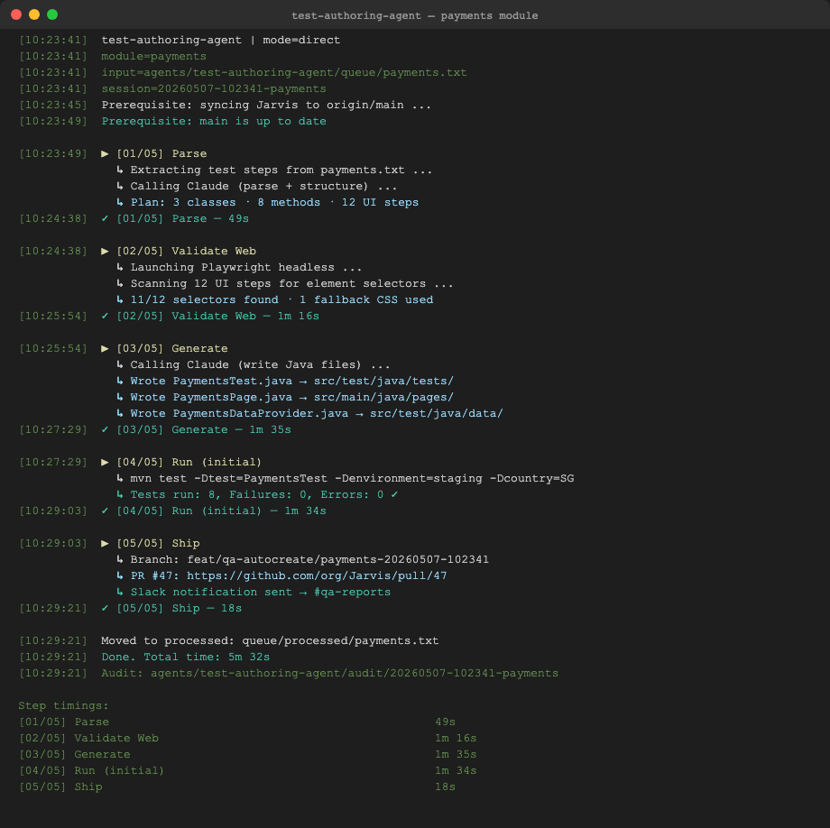
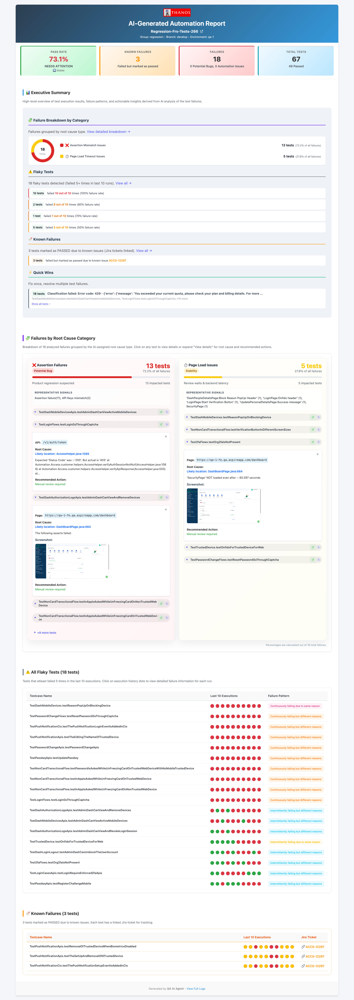
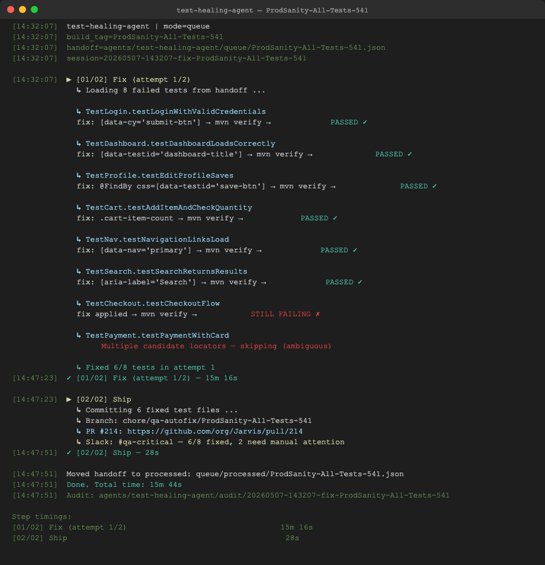

<div>
  

  # QA Agent Network

  [](https://www.python.org/)
  [](LICENSE)
</div>

*An AI-driven multi-agent system for end-to-end QA automation — authoring tests, triaging failures, and self-healing broken locators.*

---

**📖 Read the feature deep-dives on the portfolio site:**

| Feature | Write-up |
|---------|----------|
| Full system overview | [msr5464.github.io/ai-agent-network](https://msr5464.github.io/ai-agent-network.html) |
| Test Authoring Agent | [feature-test-authoring](https://msr5464.github.io/feature-test-authoring.html) |
| Test Triaging Agent | [feature-test-triaging](https://msr5464.github.io/feature-test-triaging.html) |
| Test Healing Agent | [feature-test-healing](https://msr5464.github.io/feature-test-healing.html) |
| Talk to Tests (RAG Chat) | [feature-rag-chat](https://msr5464.github.io/feature-rag-chat.html) |

---

## Documentation

| Doc | Purpose |
|-----|---------|
| [ARCHITECTURE.md](docs/ARCHITECTURE.md) | System design, agent responsibilities, data flow, audit structure |
| [DEVELOPER_GUIDE.md](docs/DEVELOPER_GUIDE.md) | Local dev setup, running agents, TESTING_MODE, debugging tips |
| [TROUBLESHOOTING.md](docs/TROUBLESHOOTING.md) | Common errors and how to fix them, per agent |
| [SERVER_API.md](docs/SERVER_API.md) | REST + SSE endpoint reference for `qa_agents_server` |
| [DEPLOYMENT.md](docs/DEPLOYMENT.md) | Windows workstation + Jenkins CI integration |

---

## How It Works

Three independent agents, each owning a distinct slice of the QA lifecycle:

```
Plain English test steps
         │
         ▼
┌─────────────────────────────────────────────────────┐
│  Agent 1: test-authoring-agent                      │
│                                                     │
│  01 Parse       → plain text → structured plan      │
│  02 Validate Web→ Playwright headless selector scan │
│  03 Generate    → write Java files to Jarvis repo   │
│  04 Run + Fix   → mvn test → Claude fix → retry    │
│  05 Ship        → branch + PR + Slack               │
└─────────────────────────────────────────────────────┘

CI test build finishes
         │
         ▼
┌─────────────────────────────────────────────────────┐
│  Agent 2: test-triaging-agent                       │
│                                                     │
│  01 Scout    → pick unanalyzed build tag from DB    │
│  02 Collect  → DB query + HTML log parse            │
│  03 Classify → Claude batch-classifies failures     │
│  04 Review   → adversarial review + verdict gate    │
│  05 Ship     → HTML report + Slack + handoff JSON   │
└──────────────────────────┬──────────────────────────┘
                           │  queue/<build_tag>.json
                           │  (AUTOMATION_ISSUE HIGH ELEMENT_NOT_FOUND only)
                           ▼
┌─────────────────────────────────────────────────────┐
│  Agent 3: test-healing-agent                        │
│                                                     │
│  01 Fix  → Claude generates locator fix per test    │
│            → applies fix, runs test, rolls back     │
│              on failure, retries up to N times      │
│  02 Ship → push branch → GitHub PR → Slack          │
└─────────────────────────────────────────────────────┘
```

**Agent 1** takes plain English test steps and generates complete, framework-compliant Java test code, verifies it headlessly, runs it with Maven, fixes failures iteratively, and raises a GitHub PR.

**Agent 2** classifies every CI failure as `PRODUCT_BUG` or `AUTOMATION_ISSUE`, writes an HTML report, and queues only the fixable locator failures for Agent 3.

**Agent 3** picks up the queue, fixes broken locators using Claude, verifies each fix by running the test with Maven, and opens a GitHub PR. If only some tests are fixed, it still ships a PR for what passed and alerts on what didn't.

**Example Slack messages from Agent 3:**

All tests fixed → posted to `#qa-reports`
```
✅ QA Auto-Fix — ProdSanity-All-Tests-541
8/8 tests fixed

✅ Fixed (8):
  • TestLogin.testLoginWithValidCredentials — updated locator [data-cy='submit-btn']
  • TestDashboard.testDashboardLoadsCorrectly — updated locator #dashboard-header
  • TestProfile.testEditProfileSaves — @FindBy css updated to [data-testid='save-btn']
  • ... and 5 more
  PR: https://github.com/org/automation-repo/pull/214

Audit: 20260329-143022-fix-ProdSanity-All-Tests-541
```

Partial fix → posted to `#qa-critical`
```
🟡 QA Auto-Fix — ProdSanity-All-Tests-541
5/8 tests fixed — 3 need manual attention

✅ Fixed (5):
  • TestLogin.testLoginWithValidCredentials — updated locator [data-cy='submit-btn']
  • TestDashboard.testDashboardLoadsCorrectly — updated locator #dashboard-header
  • ... and 3 more
  PR: https://github.com/org/automation-repo/pull/214

❌ Could not fix (3) — manual review required:
  • TestCheckout.testCheckoutFlow — fix applied but test still failing
  • TestPayment.testPaymentWithCard — unfixable: multiple candidate locators, ambiguous
  • TestLogout.testSessionExpiry — test file not found in workspace

Audit: 20260329-143022-fix-ProdSanity-All-Tests-541
```

---

## Quick Start

### 1. Install

```bash
git clone <repository-url>
cd QA-Agent-Network

./scripts/setup.sh          # macOS / Linux
.\scripts\setup.ps1         # Windows
```

### 2. Configure

```bash
cp config/.env.example config/.env
```

Edit `config/.env` and fill in the required values (see Configuration Reference below).

---

### Agent 1 — Test Authoring

Generates Java test code from a plain English input file and raises a PR on the Jarvis automation repo.

```bash
# Create an input file describing what to test
cat > agents/test-authoring-agent/queue/payments.txt << 'EOF'
Module: payments
Type: web

Steps:
1. Navigate to https://app.staging.example.com
2. Login as Admin user
3. Click New Payment and fill in recipient + amount
4. Submit and verify success message appears
EOF

# Run (direct mode — process a specific module)
make run AGENT=test-authoring-agent MODULE=payments

# Queue mode — picks the oldest .txt file in queue/
make run AGENT=test-authoring-agent

# Dry-run — generates and tests locally, no PR pushed
AUTO_PUSH=false make run AGENT=test-authoring-agent MODULE=payments

# Testing mode — reuses cached step-01 and step-02 outputs (saves ~3 min per iteration)
TESTING_MODE=true make run AGENT=test-authoring-agent MODULE=payments
```

Outputs:
- Java files written to the Jarvis automation repo
- GitHub PR on the Jarvis repo (`feat/qa-autocreate/<module>-<timestamp>`)
- Slack notification to `SLACK_NOTIFY_CHANNEL`



---

### Agent 2 — Test Triaging

Analyses a CI build, classifies every failure, writes an HTML report, and queues fixable locator failures for Agent 3.

```bash
# macOS / Linux
./scripts/run-analyse.sh                              # auto-selects most recent unanalyzed build
./scripts/run-analyse.sh ProdSanity-All-Tests-541     # specific build tag
STOP_AFTER=classify ./scripts/run-analyse.sh          # stop early for inspection

# Windows
.\scripts\run-analyse.ps1 -BuildTag ProdSanity-All-Tests-541
```

Outputs:
- HTML report → `OUTPUT_DIR/`
- Handoff file → `agents/test-healing-agent/queue/<build_tag>.json` (if fixable issues found)
- Slack notification → `SLACK_NOTIFY_CHANNEL` or `SLACK_ALERT_CHANNEL`



---

### Agent 3 — Test Healing

Picks up the handoff from Agent 2, fixes broken locators, verifies with Maven, and raises a PR.

```bash
# macOS / Linux
./scripts/run-autofix.sh                              # process oldest item in queue
./scripts/run-autofix.sh ProdSanity-All-Tests-541     # specific build tag
./scripts/run-autofix.sh /path/to/handoff.json        # pass handoff file directly
AUTO_PUSH=false ./scripts/run-autofix.sh              # dry-run: fix + test locally, no PR

# Windows
.\scripts\run-autofix.ps1 -BuildTag ProdSanity-All-Tests-541
.\scripts\run-autofix.ps1 -HandoffFile C:\path\to\handoff.json
```

Outputs:
- GitHub PR with all passing fixes on the Jarvis repo (`chore/qa-autofix/<build-tag>`)
- Slack notification with per-test breakdown



---

## Configuration Reference

### Shared

| Variable | Default | Purpose |
|----------|---------|---------|
| `CLAUDE_CLI_PATH` | `claude` | Path to Claude CLI binary |
| `GITHUB_TOKEN` | | GitHub personal access token (repo scope) |
| `GITHUB_ORG` | | GitHub org or username owning the automation repo |
| `GITHUB_REPO_AUTOMATION` | `Jarvis` | Name of the automation repo directory under `WORKSPACE_DIR` |
| `GITHUB_DEFAULT_BRANCH` | `main` | Base branch for PRs |
| `GITHUB_PR_REVIEWERS` | | Comma-separated list of PR reviewer handles |
| `WORKSPACE_DIR` | | Absolute path to the parent directory containing the automation repo. If the repo is absent it is cloned automatically using `GITHUB_TOKEN`. |
| `SLACK_BOT_TOKEN` | | Slack Bot OAuth token (`xoxb-...`) |
| `SLACK_NOTIFY_CHANNEL` | `#qa-reports` | Channel for normal results and successful fixes |
| `SLACK_ALERT_CHANNEL` | `#qa-critical` | Channel for failures needing human attention |
| `AUTO_PUSH` | `true` | Set `false` to skip PR creation (dry-run mode) |

### Agent 1 — test-authoring-agent

| Variable | Default | Purpose |
|----------|---------|---------|
| `AUTOCREATE_MODEL` | `claude-opus-4-6` | Claude model for all AI steps (parse, validate, generate, fix) |
| `AUTOCREATE_BRANCH_PREFIX` | `feat/qa-autocreate` | Branch prefix. Full name: `<prefix>/<module>-<timestamp>` |
| `AUTOCREATE_ENVIRONMENT` | `staging` | Maven `-Denvironment=` value when running generated tests |
| `AUTOCREATE_COUNTRY` | `SG` | Maven `-Dcountry=` value |
| `MAX_FIX_ATTEMPTS` | `3` | Max retry cycles if the generated test fails |
| `TESTING_MODE` | `false` | Set `true` to cache step-01 and step-02 outputs and skip them on reruns |
| `PLAYWRIGHT_TIMEOUT_MS` | `30000` | Timeout per step in the headless web validation script |
| `PLAYWRIGHT_HEADLESS` | `true` | Set `false` to run validation browser in headed mode (useful for debugging selectors) |
| `NODE_PATH` | `node` | Path to Node.js binary |

### Agent 2 — test-triaging-agent

| Variable | Default | Purpose |
|----------|---------|---------|
| `DB_HOST` | `localhost` | MySQL host |
| `DB_PORT` | `3306` | MySQL port |
| `DB_USER` | `root` | MySQL user |
| `DB_PASSWORD` | | MySQL password |
| `DB_NAME` | `qa_results` | MySQL database name |
| `CLASSIFIER_MODEL` | `claude-sonnet-4-6` | Claude model for failure classification |
| `REVIEWER_MODEL` | `claude-sonnet-4-6` | Claude model for adversarial review |
| `CLASSIFIER_EFFORT` | `medium` | Effort level for classifier (`low` `medium` `high`) |
| `REVIEWER_EFFORT` | `medium` | Effort level for reviewer |
| `BUILD_TAG` | | Skip scout and analyse this build directly |
| `STOP_AFTER` | | Stop pipeline after: `scout` `collect` `classify` `review` |
| `SCOUT_LOOKBACK_DAYS` | `7` | How far back scout looks for unanalyzed builds |
| `MAX_REVIEW_ROUNDS` | `2` | Max classifier ↔ reviewer debate rounds |
| `FLAKY_TESTS_LAST_RUNS` | `10` | Window for flaky test detection |
| `FLAKY_TESTS_MIN_FAILURES` | `5` | Min failures in window to be flagged as flaky |
| `INPUT_DIR` | `testdata` | Directory containing HTML test reports |
| `OUTPUT_DIR` | `reports` | Directory for generated HTML triage reports |
| `AUTOFIX_QUEUE_DIR` | `agents/test-healing-agent/queue` | Where to write handoff files for Agent 3 |

### Agent 3 — test-healing-agent

| Variable | Default | Purpose |
|----------|---------|---------|
| `AUTOFIX_MODEL` | `claude-opus-4-6` | Claude model for fix generation |
| `AUTOFIX_BRANCH_PREFIX` | `chore/qa-autofix` | Branch prefix. Full name: `<prefix>/<build-tag>` |
| `MAX_FIX_ATTEMPTS` | `2` | Retry cycles if tests still fail after fix |
| `AUTO_FIX_MAX_FIXES_PER_RUN` | `5` | Max tests to fix per session |
| `TEST_RUNNER_CMD` | auto-detect | Override test runner. Placeholders: `{class}` `{class_simple}` `{method}` |
| `REPO_CONTEXT_FILE` | `CONVENTIONS.md` | Path to conventions file (relative to automation repo root, or absolute). Falls back to the bundled `agents/test-healing-agent/CONVENTIONS.md`. |

---

## Slack Notifications

Both Agent 2 and Agent 3 post to Slack using the **Slack Bot API** (`chat.postMessage`).

### Setup

1. Go to [api.slack.com/apps](https://api.slack.com/apps) → **Create New App** → From scratch
2. **OAuth & Permissions** → Bot Token Scopes → add `chat:write`
3. **Install to Workspace** → copy the **Bot User OAuth Token** (`xoxb-...`)
4. In each target channel, run `/invite @your-bot-name`

### What gets posted

| Event | Channel |
|-------|---------|
| Agent 1: PR created for generated tests | `NOTIFY` |
| Agent 2: analysis complete, verdict APPROVED | `NOTIFY` |
| Agent 2: analysis complete, verdict NEEDS-HUMAN | `ALERT` |
| Agent 3: all tests fixed, PR created | `NOTIFY` |
| Agent 3: some tests fixed, some failed | `ALERT` |
| Agent 3: no tests could be fixed | `ALERT` |

If `SLACK_ALERT_CHANNEL` is not set, all messages go to `SLACK_NOTIFY_CHANNEL`. If `SLACK_BOT_TOKEN` is not set, Slack is silently skipped.

---

## Project Structure

```
QA-Agent-Network/
├── agents/
│   ├── test-authoring-agent/      # Agent 1 — generate Java tests from plain English
│   │   ├── run.sh                 # Orchestrator (steps 01–05)
│   │   ├── CLAUDE.md              # Full agent spec (read by Claude CLI at runtime)
│   │   ├── queue/                 # Input .txt files (one per module/feature)
│   │   └── actions/
│   │       ├── 01_parse.py        # Plain text → structured generation plan (Claude)
│   │       ├── 02_validate_web.py # Generate + run headless Playwright → selector map
│   │       ├── 03_generate.py     # Write Java files to automation repo (Claude)
│   │       ├── 04_run_and_fix.py  # mvn test → Claude fix → retry loop
│   │       └── 05_ship.py         # Branch + commit + push + gh pr create
│   │
│   ├── test-triaging-agent/       # Agent 2 — classify CI failures, write report
│   │   ├── run.sh                 # Orchestrator (steps 01–05)
│   │   ├── CLAUDE.md              # Full agent spec
│   │   ├── feedback/              # skip-buildtags.json
│   │   └── actions/
│   │       ├── 01_scout.py        # Pick unanalyzed build tag from DB
│   │       ├── 02_collect.py      # DB query + HTML log parse + flaky detection
│   │       ├── 03_classify.py     # Batch classify failures via Claude
│   │       ├── 04_review.py       # Adversarial review + .verdict gate
│   │       └── 05_ship.py         # HTML report + handoff JSON + Slack
│   │
│   └── test-healing-agent/        # Agent 3 — fix broken locators, raise PR
│       ├── run.sh                 # Orchestrator (queue / direct / file-path mode)
│       ├── CLAUDE.md              # Full agent spec
│       ├── CONVENTIONS.md         # Fallback conventions file for Claude
│       ├── queue/                 # Handoff JSON files from Agent 2
│       ├── feedback/              # known-issues.json (patterns to skip auto-fix)
│       ├── lib/
│       │   └── code_analyzer.py   # Static analysis: locate test files, page objects, elements
│       └── actions/
│           ├── 01_fix.py          # Build context → Claude fix → apply → mvn verify → commit
│           └── 02_ship.py         # Push branch → gh pr create → Slack
│
├── shared/                        # Shared Python + shell helpers used by all agents
│   ├── claude.py                  # Claude CLI wrapper
│   ├── github.py                  # GitHub API helpers
│   ├── slack.py                   # Slack Bot API helpers
│   ├── git.py                     # Git command wrappers
│   ├── log.py                     # Structured logging
│   ├── audit.py                   # Audit trail helpers
│   ├── load_env.sh                # .env loader (root → agent override)
│   └── session.sh                 # Session helpers: log, run_step, fmt_duration
│
├── qa_agents_server/              # Thin HTTP + SSE server for UI integration
│   ├── app.py
│   ├── routes.py
│   └── runner.py
│
├── config/
│   ├── .env.example               # All env vars documented with defaults
│   └── prompts.yaml               # Prompt templates
│
├── scripts/
│   ├── run-analyse.sh / .ps1      # Entry point for Agent 2
│   ├── run-autofix.sh / .ps1      # Entry point for Agent 3
│   ├── run-server.sh              # Start the HTTP server
│   └── setup.sh / .ps1            # Install dependencies
│
└── tests/                         # Unit tests
```

---

## HTTP Server (for UI integration)

The repo ships a thin HTTP + SSE server (`qa_agents_server/`) used by the AI Test Studio "QA Agents" tab to trigger authoring runs and stream live progress. CLI users do not need it.

```bash
bash scripts/run-server.sh
# Listens on http://0.0.0.0:8765 by default
```

Key endpoints (scoped to `test-authoring-agent` for v1):

| Method | Path | Purpose |
|--------|------|---------|
| `GET`  | `/health` | Service health + active run id |
| `GET`  | `/agents/test-authoring-agent/queue` | List feature files in `queue/` |
| `POST` | `/agents/test-authoring-agent/queue` | Create or update a feature file |
| `POST` | `/agents/test-authoring-agent/run` | Trigger a run — returns `session_id` |
| `GET`  | `/agents/test-authoring-agent/run/active` | Active run (for UI re-attach) |
| `GET`  | `/agents/test-authoring-agent/run/<id>/stream?offset=N` | SSE: live + replay |
| `POST` | `/agents/test-authoring-agent/run/<id>/cancel` | SIGTERM the run |
| `GET`  | `/agents/test-authoring-agent/sessions` | Audit history |
| `GET`  | `/agents/test-authoring-agent/sessions/<id>` | Full session detail |

Environment overrides:

| Variable | Default | Purpose |
|----------|---------|---------|
| `QA_AGENT_SERVER_HOST` | `0.0.0.0` | Bind host |
| `QA_AGENT_SERVER_PORT` | `8765` | Bind port |
| `AI_TEST_STUDIO_URL` | `http://localhost:5001` | CORS allowlist |
| `QA_AGENT_RUN_TIMEOUT_SECONDS` | `1800` | SIGKILL after this many seconds |

---

## Troubleshooting

**"Queue is empty — nothing to fix"**
Run Agent 2 first. Agent 3's queue is only populated when Agent 2 finds `AUTOMATION_ISSUE + HIGH confidence + ELEMENT_NOT_FOUND` failures with an `APPROVED` verdict.

**"Automation repo not found at \<path\>"**
The automation repo will be cloned automatically if `GITHUB_TOKEN`, `GITHUB_ORG`, and `GITHUB_REPO_AUTOMATION` are set. Check that these are all present in `config/.env`.

**"No test results found in database"**
Your test runner must insert results into MySQL before running Agent 2. The agent queries by `buildTag` (the directory name of the test report).

**"claude: command not found"**
Set `CLAUDE_CLI_PATH` in `config/.env` to the full path of the Claude CLI binary.

**PR not created after fix**
Check `agents/test-healing-agent/audit/<session>/02-ship.md` for the exact reason. Common causes: push failed (check `GITHUB_TOKEN` permissions), no successful fixes to commit, `AUTO_PUSH=false`.

**Generated tests fail during step 04**
Set `TESTING_MODE=true` and re-run — the cached step-01/02 outputs are reused so you can iterate on generation and fix logic without waiting for parsing and web validation on every run.

---

## License

MIT — see [LICENSE](LICENSE)

---

## Creator

**Mukesh Rajput** · [LinkedIn](https://www.linkedin.com/in/mukesh-rajput/)

<div align="center"><strong>Made with ❤️ for the Engineering Team</strong></div>
